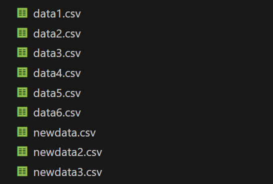
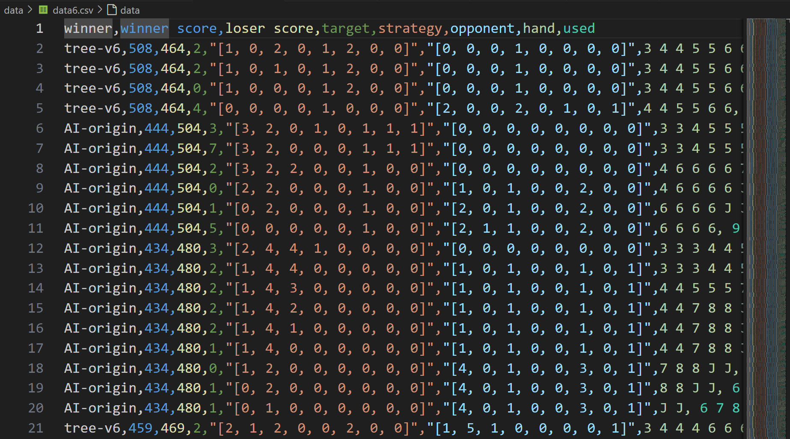
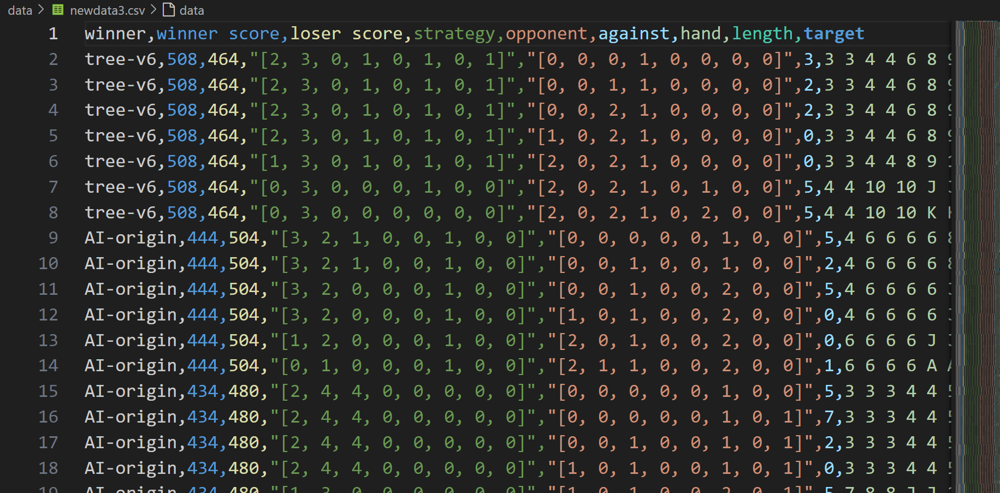
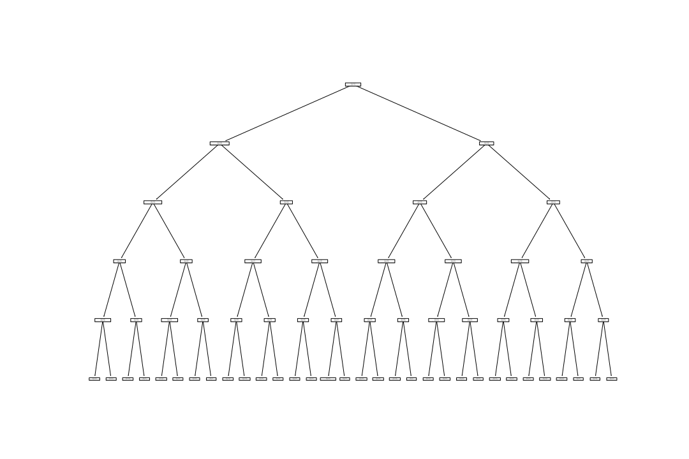
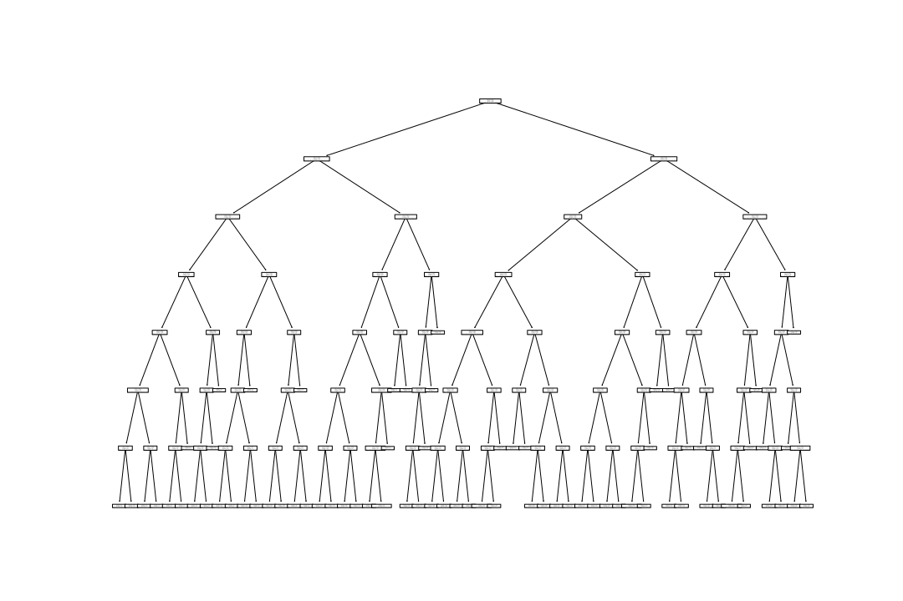
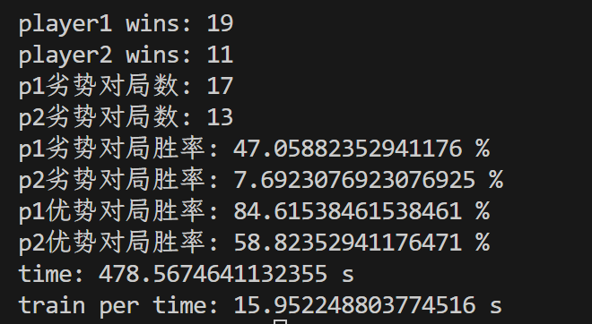
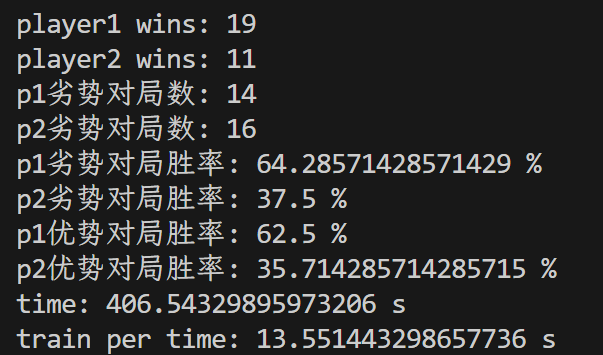
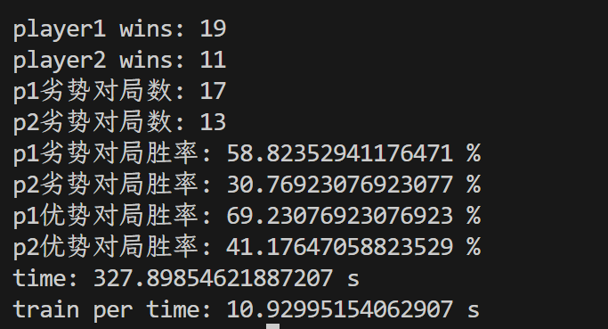

# Python AI 小游戏：掼蛋

## 环境依赖

`scikit-learn (1.4.1.post1)`

`joblib`

`numpy`

> 我用的scikit-learn的版本是1.4.1的，训练的模型也是这个版本，尽量选择相同版本。
>
> 如果版本不同的话，运行时请用命令`python -W ignore runner.py`来忽略答应警告信息

## 游戏运行

1. 下载文件夹CardGame

2. 在终端中`cd`进入CardGame文件夹，再输入`python runner.py`（`python -W ignore runner.py`）即可运行游戏。或者在vscode等编辑器中打开，在文件夹中找到`runner.py`, 点击运行按钮即可。

3. 进入游戏后，请先输入用户名，然后选择是否启用提示（即轮到玩家出牌时，会有AI(即为最终AI)提示推荐出的牌）

4. 接下来，选择AI的难度，总共有4种选择。

   > - 输入牌时要全部大写字母，可以启用键盘的大写锁定。
   >
   >
   > - 首次AI出牌或对牌时，AI所需搜索时间较长，一般在5s以内，为正常现象
   > - 如果开启出牌提示，首次出牌时请等待AI搜索完成(5s以内)，给出提示后再出牌。

## 选题描述

我选择的项目是：**掼蛋**

本程序实现了玩家与基本AI的对弈功能。

游戏概述与规则如下：

- 牌点由大到小排列为：2、Ａ、Ｋ、Ｑ、Ｊ、10、 ９、８、７、６、５、４、３。

- 相同牌型之间的大小比较

  - a. 单张、对子、三同张、三连对、三同连张、顺子，以上六种牌型直接根据牌点确定大小。

  - b. 三带对：仅比较三同张牌点大小，不比较所带对子牌点大小。

  - c. 炸弹：张数多者大，张数相同则比较牌点大小。

- 不同牌型之间的大小比较

  - a. 炸弹 > 其他7种牌型（单张、对子、三同张、三带对、三连对、三同连张和顺子）

- 出牌规则
  - a. 若自己为下家则必须与上家出同种类型且更大；若为上家，则可以任意出牌
  
  - b. 先出的一方为上家，跟牌的一方为下家；若某一回合无法接牌，选择pass，则对方自动成为上家
  
    

实现目标：实现基于机器学习算法的游戏AI

1. 利用机器学习算法训练斗地主策略。
2. 探索和实践不同特征表示方法，提升模型性能。
3. （有能力选做）完善一些用户友好型功能，如：
   - 实时提示与帮助：在游戏过程中，为玩家提供实时的出牌提示和规则帮助。例如，当玩家轮到
     出牌时，系统可以提示当前可出的牌型范围或推荐出牌，帮助新手玩家更快熟悉游戏。
   - 调整游戏难度：提供不同难度级别的AI对手，玩家可以根据自己的水平选择合适的难度。随着
     玩家技术的提升，可以逐步挑战更高级别的AI，保持游戏的挑战性和趣味性。

## class表格

|    Class     | Inheritance |           Attributes           |                       Methods                        |
| :----------: | :---------: | :----------------------------: | :--------------------------------------------------: |
|   `Player`   |   `None`    |          `name, hand`          | `play, against, check_win, check_type, display_hand` |
|     `AI`     |  `Player`   | `name, hand, change, strategy` | `play, against, recognize, choose_best, remove_hand` |
|    `Game`    |   `None`    |       `human, AI, turn`        |              `play_round, print_cards`               |
|    `Card`    |   `None`    |         `value, type`          |                      `compare`                       |
|    `Pair`    |   `Card`    |               /                |                          /                           |
|   `Triple`   |   `Card`    |               /                |                          /                           |
| `Continuous` |   `Card`    |               /                |                          /                           |
| `ThreePairs` |   `Card`    |               /                |                          /                           |
| `TwoTriple`  |   `Card`    |               /                |                          /                           |
|    `Boom`    |   `None`    |        `value, number`         |                      `compare`                       |
|  `ThreeTwo`  |   `None`    |          `three, two`          |                      `compare`                       |

以上为程序中所有类的属性，方法与继承关系。便于梳理与查找相应函数。

## 方案设计

本项目主题采用OOP，面向对象进行编程。由于玩家与AI不能互相访问对方数据，因此用类来封装很合适。并且各种牌型之间具有相似性，可以用继承来避免代码的重复。AI与玩家的部分相同操作可以通过继承来实现。

project分为3个板块，分别体现为3个文件game.py, ai.py, runner.py。其中game.py 包含游戏运行的主题部分，包括game class，player class 和各种牌型和牌堆。ai.py 包含了ai的出牌与对牌策略与基础的搜索算法。runner.py包含了主程序运行的框架，用于组合代码。

### Game类

定义了一个名为 `Game` 的类，用于模拟一场游戏，包括初始化游戏、打印玩家的牌和进行一轮游戏。以下是代码的主要部分：

1. `__init__(self, human, AI)`: `Game` 类的初始化方法，接受两个参数 `human` 和 `AI`，分别代表人类玩家和AI玩家。此外，它还随机选择一个玩家作为游戏的第一个回合。
2. `print_cards(self, who, display)`: 这个方法用于打印指定玩家所出的牌和剩余牌数。
3. `play_round(self)`: 这个方法用于进行一轮游戏。并且根据上下家关系切换出牌与对牌顺序。直至有玩家pass则进入新的一轮，如果过程中有一方手牌为空，则游戏结束，判定胜负。

### Player类

定义了一个名为`Player`的类，用于表示游戏中的玩家。这个类有几个方法，包括初始化方法`__init__`，显示手牌的方法`display_hand`，检查牌型的方法`check_type`，出牌的方法`play`，检查是否赢得游戏的方法`check_win`，以及对抗其他玩家的方法`against`。

1. 在`__init__`方法中，首先设置了玩家的名字，然后初始化了一个空的手牌列表。接着，从牌堆中随机抽取27张牌添加到手牌中，并从牌堆中移除这些牌。最后，对手牌进行排序。

2. `display_hand`方法用于打印出玩家当前的手牌。

3. `check_type`方法用于检查给定的牌是否符合特定的牌型。这个方法会根据牌的数量和牌面值来判断牌型，包括单张，对子，三同张，炸弹，顺子，三带对，飞机和三连对等。

4. `play`方法用于玩家出牌。首先显示玩家的手牌，然后提示玩家输入要出的牌。如果玩家输入的牌不在手牌中，或者输入的牌型不正确，就会提示玩家重新输入。如果玩家输入的牌型正确，就会从手牌中移除这些牌，并返回出的牌。

5. `check_win`方法用于检查玩家是否赢得了游戏。如果玩家的手牌为空，就表示玩家赢得了游戏。

6. `against`方法用于玩家对抗其他玩家。这个方法的流程和`play`方法类似，但是在检查牌型和大小时，还会考虑到对手的牌。如果玩家的牌不能打过对手的牌，就会提示玩家重新出牌。

### Card类

Card的单张是最基本的牌型，属性有value。在game.py中定义了牌堆，牌堆中的每个元素都为字符串。另外还定义了`card_order`, 这是一个字典。key为牌的字符串，value为相应的权值。定义的函数`custom_compare`可以对两个牌进行比较，通过`cmp_to_key`可以转换为`sort`函数的key，从而对手牌进行排序。同时，类函数`compare`也调用`custom_compare`比较牌值大小。

对于每种牌型，都定义了`__repr__`函数，便于在展示出牌时显示特定样式。

其他的牌型与单张大相径庭。`Boom`和`ThreeTwo`覆盖了继承的`compare`函数，炸弹的优先级高于其他牌型，在与炸弹比较时先考虑张数，再考虑大小。三带对比较时只看三张的大小。

## 初级AI算法

本项目主要采用搜索算法。先对AI的手牌的所有出牌方式进行搜索，再根据评估函数对每种出牌方式进行赋值，选择权值最大的几种出牌方式。

### 评估函数

```python
# 权值由game.py的card_order定义
# 计算每种牌型的权值
def hash(instance):
    if instance.type == '单张':
        return card_order[instance.value]
    elif instance.type == '对子':
        return 2 * card_order[instance.value] + 6
    elif instance.type == '三同张':
        return 3 * card_order[instance.value] + 10
    elif instance.type == '顺子':
        return 5 * card_order[instance.value] + 10 + 15
    elif instance.type == '三连对':
        return 6 * card_order[instance.value] + 6 + 18
    elif instance.type == '炸弹':
        return instance.number * card_order[instance.value] + 28 + 2 * (instance.number - 4)
    elif instance.type == '飞机':
        return 6 * card_order[instance.value] + 3 + 24
    elif instance.type == '三带对':
        return 3 * card_order[instance.three] + 2 * card_order['8'] + 15
```

`hash`函数，它用于计算每种牌型的权值。这个函数接收一个参数`instance`，代表一种牌型的类的实例。函数根据牌型的类型和值计算权值，权值的计算规则由`game.py`的字典`card_order`定义。

赋值的思路主要是根据每种牌型，在基础牌值乘以张数的基础上加上某个附加值，例如对子，顺子，三连对的附加值为3，三同张的附加值为3.33，飞机的附加值为4，炸弹的附加值为7，但是炸弹在4张之后效益衰减，每张的附加值为2，三带对由于与两张的大小无关，因此两张按固定的不大不小的牌8来计算。

### 出牌方式搜索

```python
def recognize(self, hand):
        """
        返回一个所有出牌方式的list, 每个元素是一个字典, 记录了每种牌型的数量
        """
        # 用字典记录每种牌的数量
        ways = {'单张': [], '对子': [], '三同张': [], '顺子': [], '三连对': [], '炸弹': [], '飞机': [], '三带对': []}
        # dfs 递归遍历所有可能的牌型
        def count_cards(cards, card_count):
            res = []
            # 减少递归深度，提高运行速度
            if len(card_count['单张']) >= 7:
                return []
            if len(cards) == 0:
                return [card_count]
            if len(cards) == 1:
                current = deepcopy(card_count)
                current['单张'].append(Card(cards[0]))
                return [current]
            else:
                unique = list(set(cards))
                unique.sort(key=key_func)
                # 单张
                current = deepcopy(card_count)
                current['单张'].append(Card(cards[0]))
                res.extend(count_cards(cards[1:], current))
                ...
                return res            
        return count_cards(hand, ways)
```

这个函数是算法的核心。主要通过递归的DFS算法实现搜索。

这个方法接收一个参数`hand`，返回一个包含所有可能出牌方式的列表。每个元素是一个字典，记录了每种牌型的数量。先定义了一个字典`ways`，用于记录每种牌型的数量。然后定义一个名为`count_cards`的内部函数，这个函数通过深度优先搜索（DFS）递归遍历所有可能的牌型，并记录每种牌型的数量，由于手牌是排好序的，因此可以从左到右依次对第一张牌进行查找，找到包含第一张牌在内的所有牌型，然后对剩余的牌进行递归调用。最后，`recognize`方法返回`count_cards`函数的结果。


> 由于刚开始27张牌的递归深度太深，程序的运行实现较长，经过测试，需要30s左右才能返回结果，因此为了优化运行速度，我设置了递归条件，如果单张的数量大于7张，则终止递归。经过优化后，程序的算牌时间减少到了5-10s。

### 策略

#### 出牌

`play`方法为AI的出牌策略：

首先，代码检查了一个名为`change`的标志变量。如果`change`为`True`，则表示需要重新选择最优出牌方式。接下来，代码调用了`choose_best`函数来选择最优的出牌方式，并将结果保存在`self.strategy`中。

然后，代码从`self.strategy`中取出最优的出牌方式，保存在变量`best`中。接下来，代码按照一定的优先级顺序判断最优出牌方式的各个牌型是否有剩余牌可出。

最后，代码将`change`设置为`True`，表示每次出牌后需要重新选择最优出牌方式。

通过按照一定的优先级顺序出牌，确保了AI在每次出牌时都能选择最优的牌型，从而提高了胜率。

#### 对牌

`against`方法为AI的对牌策略：

首先，定义两个辅助函数：`in_plan()`和`check_combat()`。这两个函数的作用是在AI的出牌策略中查找合适的牌来应对对手的出牌。

`in_plan()`函数首先获取AI当前最优的出牌策略，即`self.strategy[0]`。然后遍历这个策略中的每个牌型（例如单张、对子、三同张等），找到与对手出牌类型相同且比对手出牌大的牌。

`check_combat()`函数的逻辑与`in_plan()`类似，但是它会遍历除了最优策略之外的其他策略。它会查找与对手出牌类型相同且比对手出牌大的牌，并将其从手牌中移除。

接下来，如果`self.change`为True，说明AI的出牌策略已经发生了变化，需要重新选择最优的出牌策略。这里使用了`self.choose_best()`函数来选择最优的出牌策略。

然后，代码根据对手剩余的牌数来决定采取哪种出牌策略。如果对手剩余的牌数大于7张，AI会按照最优策略出牌，调用`in_plan()`函数来选择合适的牌。否则，AI会按照最优策略对牌进行出牌。首先，它会调用`in_plan()`函数来选择合适的牌。如果找到了符合条件的牌，则返回该牌作为出牌策略。如果没有找到合适的牌，AI会尝试出炸弹。它会遍历最优策略中的炸弹牌型，找到比对手出牌大的炸弹牌，并将其从手牌中移除。如果找到了符合条件的炸弹牌，则返回该牌作为出牌策略。如果还没有找到合适的牌，AI会尝试按照次优策略对牌进行出牌，调用`check_combat()`函数来选择合适的牌。如果找到了符合条件的牌，则返回该牌作为出牌策略。最后，如果还没有找到合适的牌，AI将返回None，表示无法出牌。


## 实现方案

本项目主要采用了基于机器学习算法的游戏AI，主要是运用了决策树和随机森林算法来拟合模型。

本项目提供了多种模型的AI可供选择

在每局游戏开始前，用户可以选择是否打开提示，提示打开后，轮到玩家出牌时会推荐下一步的牌。提示出的牌就是AI的决策，这样可以看到AI预测出的牌，以查找和分析问题。

## 设计思路

我主要优化了AI在两个方面的行为，分别是

- 当AI是上家，轮到AI出牌时，选择下一步出牌的牌型是什么？
- 当AI是下家，当AI的手牌中最优策略的出牌方式无法应对时，是选择次优策略对抗，炸弹接手，还是pass？

我的思路是将其视为**监督学习中的分类问题**，输入为当前局势的一些特征编码，输出是几个离散的数字，分别对应以上所说的几种选择。

我将实现大致分为3个部分，收集数据，训练模型，性能检测。具体见以下部分

## 具体实现

### 收集数据

#### 模拟对局

由于机器学习需要大量数据，而且互联网上对有记录的掼蛋对局的数据很少，而且很多数据不符合我的预期输入要求，因此我从自己的程序中收集数据。

由于是监督学习，需要每个数据都需要有标签。然而人工对局来收集数据效率太低，至少需要上百场的数据才能训练出合格的模型。因此，我通过两个AI对弈来产生数据。这两个AI尽量是不同类型的AI，因为如果是相同策略的AI，无论哪方或胜，机器学习学到的都是该策略，对模型的性能提升很小。当两种不同策略的AI对弈时，机器学习才会根据数据将两种策略在不同的情况下取长补短。因此最开始，我先让按固定牌型出牌顺序的AI与随机选择牌型的AI，用数据训练出第一版模型，然后再混合对弈，依次迭代出下一版。

我特意写了一个`Game_no_print`类继承自`Game`类, 这个函数没有print选项，会将每局获胜的AI的每次出牌和对牌数据记录并存储在2个`csv`文件中。



​								前前后后总共记录了以上数据集





其中主要记录了手牌，自己手牌中各种牌型的数量，对手已经出过的牌型的数量，所有已经出过的牌。

还有双方初始手牌的总权值，便于以后筛选数据用。

#### 筛选数据

对于有效的数据，只以获胜为标准是不够的，因为有些情况下AI下的并不好，但是它的初始手牌足够好，导致它最终获胜，因此我通过记录的双方初始手牌的权值。筛选出赢家的分数小于输家的分数+25的对局（即在劣势和小优的情况下获胜的对局），这样就可以筛选掉一些劣质对局，防止影响模型。

### 训练模型

#### 特征选取与编码

1. 对于出牌模型，我先后主要采用了3种特征选取和编码方式

   第一次我用的输入是自己的手牌，和所有已经出过的牌，然后按照从3-2的顺序，将每种牌的数量加入。总共有26个特征，维数比较高，而且性能不算理想。

   第二次我用的方案是将自己手牌中最优策略的每种牌型的数量作为特征，然后对手所有出过牌型的数量作为特征，总共是16维，维数降低了一些，性能稍有提高。

   第三次我在第二种方案的基础上再加上了对自己手牌的编码，信息更多了。性能有所提示。

2. 对于对牌模型

   我的输入是自己的策略，对手出过的牌型，对手的出牌，自己的手牌，对手的剩余张数，将其编码为向量

   输出是0，1，2，分别代表次优策略对牌，炸弹，过。

#### 训练方法与算法

决策树算法

```python
def train_decision_tree(data):
    X = []
    y = []
    for row in data:
        if int(row[1]) - int(row[2]) <= 25:
            sample = eval(row[4]) + eval(row[5]) + code_data(row[6])
            X.append(sample)
            y.append(int(row[3]))
    # clf = tree.DecisionTreeClassifier()
    # clf = clf.fit(X, y)
     # 创建一个预处理和分类的pipeline
    pipeline = make_pipeline(StandardScaler(), tree.DecisionTreeClassifier())
    # 定义要搜索的参数
    param_grid = {'decisiontreeclassifier__max_depth': [3, 5, 7, 10, 15, 20],
                  'decisiontreeclassifier__min_samples_split': [2, 5, 10, 15, 20, 30],
                  'decisiontreeclassifier__criterion': ['gini', 'entropy']}
    # 使用网格搜索和交叉验证
    clf = GridSearchCV(pipeline, param_grid, cv=5)
    clf = clf.fit(X, y)
    return clf
```

随机森林算法

```python
def train_random_forest(data):
    X = []
    y = []
    for row in data:
        if int(row[1]) - int(row[2]) <= 25:
            sample = eval(row[4]) + eval(row[5]) + code_data(row[6])
            X.append(sample)
            y.append(int(row[3]))
    # 创建一个预处理和分类的pipeline
    pipeline = make_pipeline(StandardScaler(), RandomForestClassifier())
    # 定义要搜索的参数
    param_grid = {'randomforestclassifier__n_estimators': [10, 50, 100],
                  'randomforestclassifier__max_depth': [None, 5, 10],
                  'randomforestclassifier__min_samples_split': [2, 5, 10]}
    # 使用网格搜索和交叉验证
    clf = GridSearchCV(pipeline, param_grid, cv=5)
    clf = clf.fit(X, y)
    return clf
```


对于决策树，我可视化了几个模型，以下是图示

model : tree_v7.joblib




model : final_tree. joblib



不同算法的实现都由scikit-learn提供了，我也尝试了SVM的模型和Naive Bayes的模型，也许是不太适合这个问题，所以性能不太好

### 性能检测

p1: forest_v4 + combat_tree_v3

p2: tree_v2

p1与p2的特征选取和编码方式不同，可见特征的选取对模型的性能有较大影响。



p1: final_forest + final_combat_forest

p2: forest_v4 + combat_tree_v3



p1：按照固定顺序的初始ai

p2：final_forest + final_combat_forest

可见机器学习确实有所效果



## 实战对局


## 不足与反思

机器学习算法对模型的性能确实有提升，但是效果不如我想象的那么理想，AI和熟练的人类玩家的水平还是存在差距。

我总结了有以下原因

- 收集的数据质量不高，由于是AI与AI的对局，有些对局不怎么具有代表性。而且掼蛋对局具有不确定性，很难说在某种情况下出哪种类型的牌是最优解，分类边界不是很清晰。
- 我模拟的游戏场数约为1000场，再经过筛选后更少。对于机器学习的对局来说，数据量还是太小。
- 对数据的特征编码还不够专业，由于我对编码方式还不够熟悉，有待在以后的机器学习课程中学习，不同的编码方式对模型的性能有很大影响。
- 对数据的处理方式比较原始。一个专业的数据分析师也许会对数据进行降维等处理方式，但是我的处理方式还是比较初级
- 我对机器学习算法的了解不够深入，在本项目中，我只是粗浅了解相关算法，只是将sklearn的相关函数作为工具，并不了解其具体实现和背后的原理，没有系统学习和深入机器学习算法和数学推导。

本项目的提升空间还有很大，在以后的课程中还需更深入地学习机器学习的知识。


